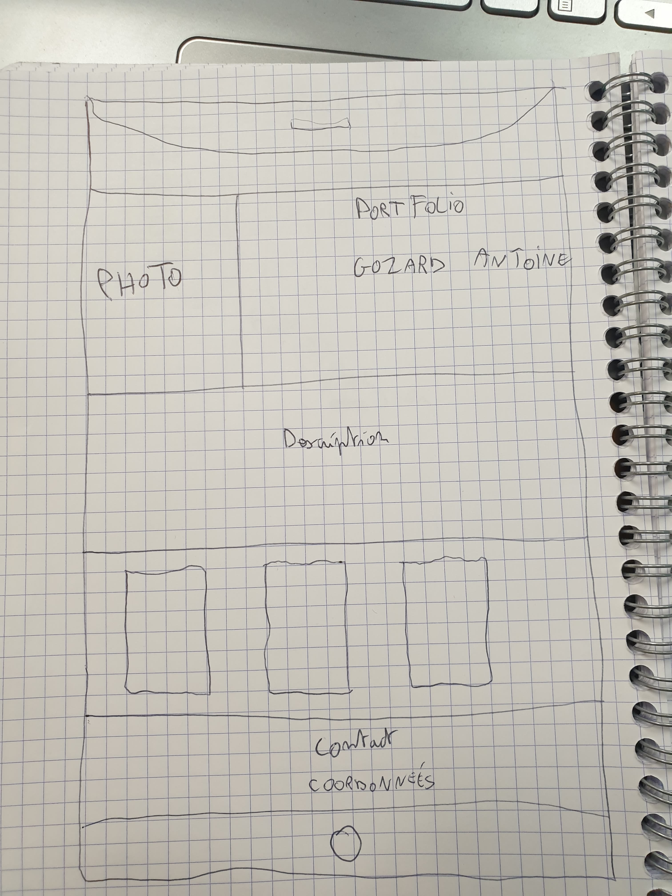
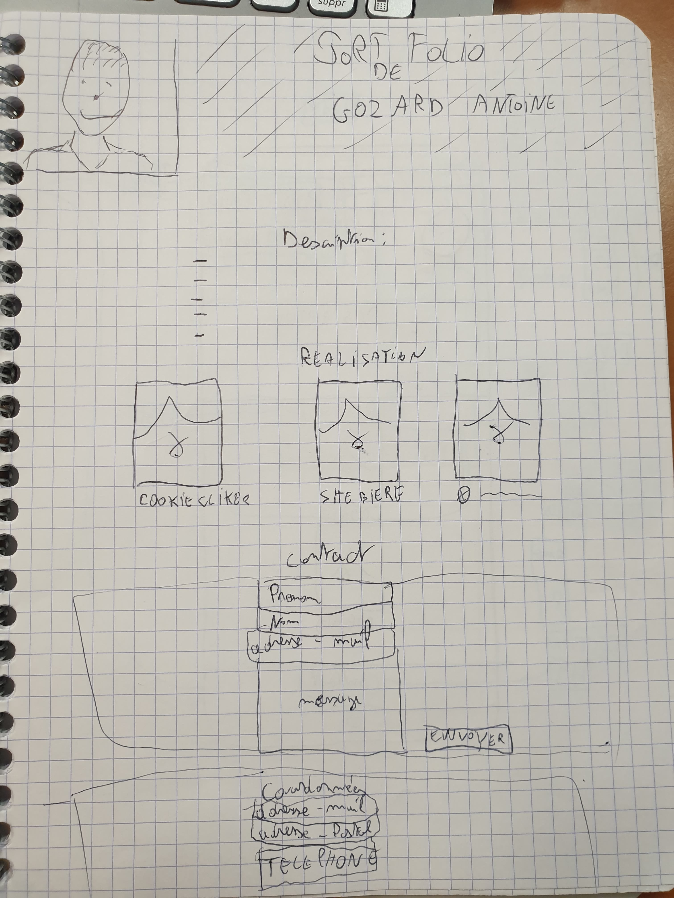
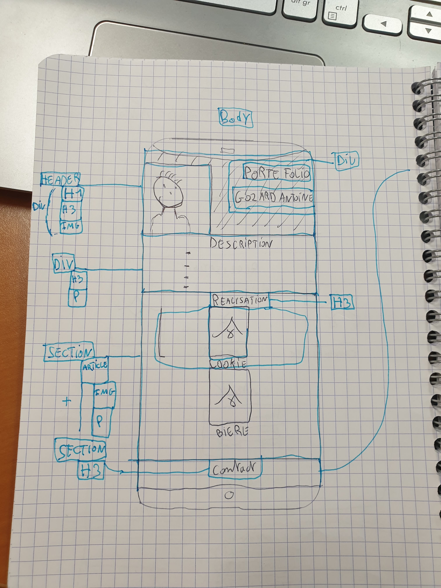
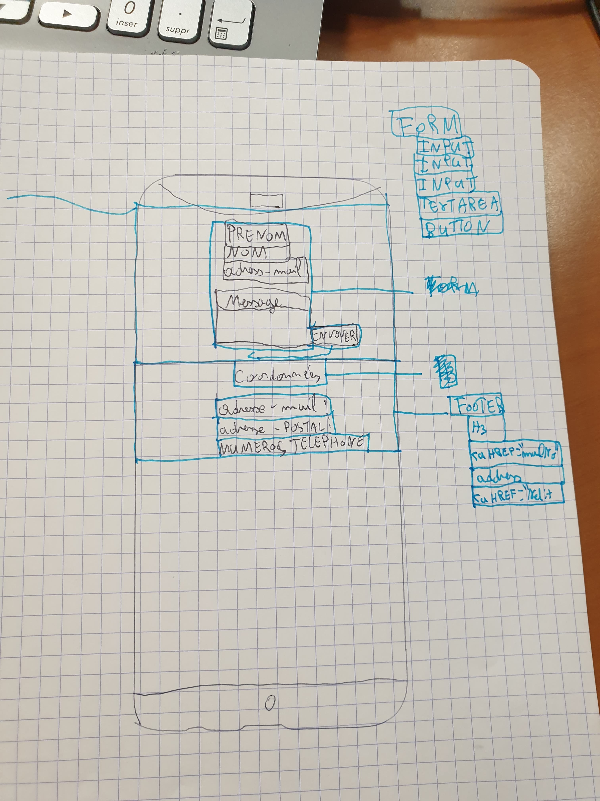

#PortFolio

##Consignes du crée un PortFolio.

-Il devras comporter : Nom, Prenom, Description, Coordonnés + formulaire de contact.

###Ressource

Gozard

Antoine

Antoine Gozard 22ans née à Montluçon le 22août 1996, j'ai suivit des études  d'éléctrotechnique au lycée PaulConstans à Montluçon.J'ai le niveau BAC.
Par la suite j'ai travailler en tant que service civique au collége de Doyet durant 9mois.Puis j'ai travailler CDDI (contrat durée déterminé insertion) durant 9mois également.
Ensuite j'ai démarrer une formation Développer  Web et Web mobile a l'aformac de Montluçon.

coordonnées : antoinego96@orange.fr / 06 74 08 10 44 / 17 rue camille claudel 03100 Montluçon.

Voici les test des croquis que j'ai réaliser:

